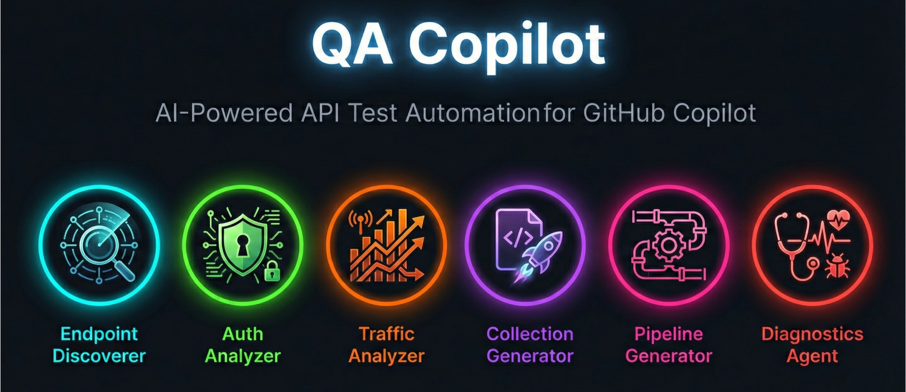

[](https://code.visualstudio.com/)
[](https://github.com/features/copilot)
[](LICENSE)
[](#agents--prompts)

# qa-copilot

**AI-powered QA automation agents for GitHub Copilot in VS Code.** Discover API endpoints, analyze auth patterns, generate Postman collections, build Azure DevOps pipelines, and diagnose test failures — all from Copilot Chat. 6 agents, 6 prompts, and 8 skills for end-to-end API integration test automation across Java, .NET, Node.js, and Python codebases.

## Why QA Copilot?

- **Codebase-Aware** — Agents read your actual source code to discover endpoints, no manual API cataloging
- **Multi-Stack** — Supports Spring Boot, ASP.NET Core, Express, NestJS, FastAPI, Flask, Django REST
- **Auth Intelligence** — Automatically maps OAuth, JWT, API Key, and Azure AD patterns for test automation
- **Traffic-Driven Priority** — Integrates Dynatrace/APM data to focus testing on highest-traffic endpoints
- **Pipeline-Ready** — Generates Newman-based Azure DevOps CI/CD pipelines with proper variable groups and secret management
- **Human-in-the-Loop** — Every agent asks for confirmation before writing files; read-only by default

## Quick Start

**1. Fork** this repo to your GitHub account: [Fork qa-copilot](https://github.com/jamesddbowers/qa-copilot/fork)

**2. Pull** the `.github` folder into your project:

```bash
# Replace YOUR_USERNAME with your GitHub username
cd /path/to/your/project
npx degit github:YOUR_USERNAME/qa-copilot/.github .github
```

> Downloads only the `.github/` folder — no git history, no full clone.

**3. Verify** — Open Copilot Chat, type `/` and you should see 6 QA prompts. Click the agent picker dropdown to see 6 custom agents.

> **Important:** The `.github/` folder must land at your **project root** with `agents/`, `prompts/`, and `skills/` directly inside it. This is the only structure GitHub Copilot recognizes.

<details>
<summary>Alternative: Git Sparse Checkout (no npm required)</summary>

```bash
cd /path/to/your/project

git clone --depth 1 --filter=blob:none --sparse \
  https://github.com/YOUR_USERNAME/qa-copilot.git temp-qa-copilot

cd temp-qa-copilot
git sparse-checkout set .github

cp -r .github ../
cd ..
rm -rf temp-qa-copilot
```

</details>

## How It Works

Work through the steps in order. Each builds on the previous. Step 3 is optional if you don't have Dynatrace/APM data.

| Step | What | Prompt | Agent |
|------|------|--------|-------|
| 1 | Discover endpoints | `/discover-endpoints` | `@endpoint-discoverer` |
| 2 | Analyze auth | `/analyze-auth` | `@auth-analyzer` |
| 3 | Prioritize from traffic *(optional)* | `/analyze-traffic` | `@traffic-analyzer` |
| 4 | Generate Postman collection | `/generate-collection` | `@collection-generator` |
| 5 | Generate ADO pipeline | `/generate-pipeline` | `@pipeline-generator` |
| 6 | Diagnose failures | `/diagnose` | `@diagnostics-agent` |

## Agents & Prompts

Type `@agent-name` or `/command` in Copilot Chat. Agents are conversational (multi-turn); prompts execute a specific task.

| Capability | Agent | Prompt | Description |
|------------|-------|--------|-------------|
| Endpoint Discovery | `@endpoint-discoverer` | `/discover-endpoints` | Scans code for REST endpoints across Java, .NET, Node.js, Python |
| Auth Analysis | `@auth-analyzer` | `/analyze-auth` | Maps OAuth, JWT, API Key, Azure AD patterns for test automation |
| Traffic Analysis | `@traffic-analyzer` | `/analyze-traffic` | Prioritizes endpoints from Dynatrace/APM traffic data |
| Collection Generation | `@collection-generator` | `/generate-collection` | Creates Postman/Newman collections with test scripts and tagging |
| Pipeline Generation | `@pipeline-generator` | `/generate-pipeline` | Generates Azure DevOps CI/CD pipeline YAML for Newman |
| Failure Diagnostics | `@diagnostics-agent` | `/diagnose` | Triages test failures with classification and remediation |

## Skills

Skills are domain knowledge files that Copilot loads automatically when relevant — no manual invocation needed.

| Skill | Domain |
|-------|--------|
| `endpoint-discovery` | Java, .NET, Node.js, Python route patterns |
| `auth-patterns` | OAuth, JWT, API Key, Azure AD automation |
| `dynatrace-analysis` | DQL queries, export formats, prioritization |
| `test-tagging` | Smoke, regression, critical, WIP conventions |
| `postman-generation` | Collection schema, assertions, request chaining |
| `test-data-planning` | Faker patterns, seeding, cleanup strategies |
| `ado-pipeline-patterns` | Newman tasks, variable groups, reporting |
| `failure-triage` | Classification matrix, remediation patterns |

## Folder Structure

> **The `.github/` folder MUST be at your project root.** This is the only location GitHub Copilot recognizes for agents, prompts, and skills.

```text
your-project/
└── .github/
    ├── copilot-instructions.md
    ├── agents/
    │   ├── endpoint-discoverer.agent.md
    │   ├── auth-analyzer.agent.md
    │   ├── traffic-analyzer.agent.md
    │   ├── collection-generator.agent.md
    │   ├── pipeline-generator.agent.md
    │   └── diagnostics-agent.agent.md
    ├── prompts/
    │   ├── discover-endpoints.prompt.md
    │   ├── analyze-auth.prompt.md
    │   ├── analyze-traffic.prompt.md
    │   ├── generate-collection.prompt.md
    │   ├── generate-pipeline.prompt.md
    │   └── diagnose.prompt.md
    └── skills/
        ├── endpoint-discovery/
        ├── auth-patterns/
        ├── dynatrace-analysis/
        ├── test-tagging/
        ├── postman-generation/
        ├── test-data-planning/
        ├── ado-pipeline-patterns/
        └── failure-triage/
```

## Output Locations

Agents never modify your application source code. All writes go to these directories only, and agents ask for confirmation before creating files.

| Directory | Contents |
|-----------|----------|
| `qa-agent-output/` | Reports, endpoint inventories, analysis documents |
| `postman/` | Collections and environment files |
| `ado/` | Pipeline YAML templates |

## Prerequisites

- VS Code **1.102+** (check: Help > About)
- GitHub Copilot extension with an active subscription
- Copilot Chat enabled
- Node.js (only needed if using `npx degit` for installation)

## Settings

These settings default to `true` in VS Code 1.99+. Only check them if agents or prompts aren't appearing:

```json
"github.copilot.chat.codeGeneration.useInstructionFiles": true,
"chat.agent.enabled": true,
"chat.useAgentSkills": true
```

> Prompt files (`.prompt.md`) require no setting — they are detected automatically from `.github/prompts/`.

**How to check:** `Cmd+Shift+P` (Mac) or `Ctrl+Shift+P` (Windows/Linux), then type "Preferences: Open User Settings (JSON)".

## Troubleshooting

| Problem | Solution |
|---------|----------|
| Prompts not appearing when typing `/` | Verify `.github/prompts/` is at project root. Reopen the folder in VS Code. |
| Agents not in dropdown | Verify `chat.agent.enabled: true`. Update VS Code to 1.102+. |
| Skills not activating | Verify `chat.useAgentSkills: true`. Check `SKILL.md` frontmatter in skill folders. |
| Nothing works at all | Confirm `.github/` is at project root (not nested inside another folder). Close and reopen VS Code. |
| Legacy `.chatmode.md` files | Use VS Code Quick Fix to convert to `.agent.md`. |

## Contributing

We welcome contributions! See [CONTRIBUTING.md](CONTRIBUTING.md) for guidelines.

## License

MIT License — see [LICENSE](LICENSE) for details.

---

[Code of Conduct](CODE_OF_CONDUCT.md) | [Security Policy](SECURITY.md)
